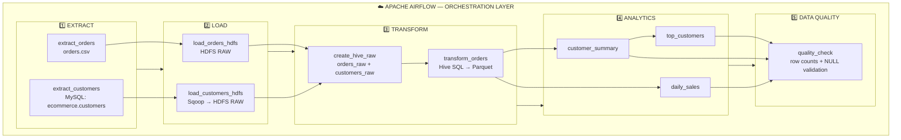

# 🛒 E-Commerce ELT Data Engineering Pipeline

An end-to-end batch ELT data engineering project built on AWS EC2 Ubuntu Linux using Hadoop, HDFS, YARN, Hive, Sqoop, MySQL, Parquet and Apache Airflow.

## 🏗️ Architecture

The pipeline is orchestrated by **Apache Airflow**. The four processing stages are explicitly separated so it is easy to see **where extraction, loading, transformation, analytics, and data quality happen**.

### 🔎 Stage-by-stage view

| Stage | What happens | Main technology | Output |
|---|---|---|---|
| **1. Extract** | Read orders from CSV and customers from MySQL | Python / MySQL | Source data |
| **2. Load** | Move source data into the raw HDFS layer | HDFS / Sqoop / Shell | HDFS raw files |
| **3. Transform** | Create Hive raw tables, clean/type-cast orders, store as Parquet | Hive SQL | `orders_transformed` |
| **4. Analytics** | Build customer, daily-sales and top-customer datasets | Hive SQL | Analytics Parquet tables |
| **5. Data Quality** | Validate row counts and NULL values | Hive + Airflow | Validated pipeline |
| **Orchestration** | Control dependencies, execution and monitoring | Apache Airflow | End-to-end workflow |

**Pipeline flow:** `CSV + MySQL → HDFS RAW → Hive RAW → Parquet → Analytics → Data Quality`

**Airflow task groups:** `extract → load → transform → analytics → quality_check`